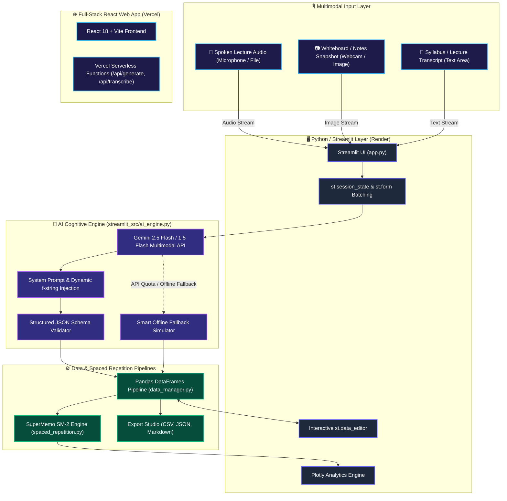
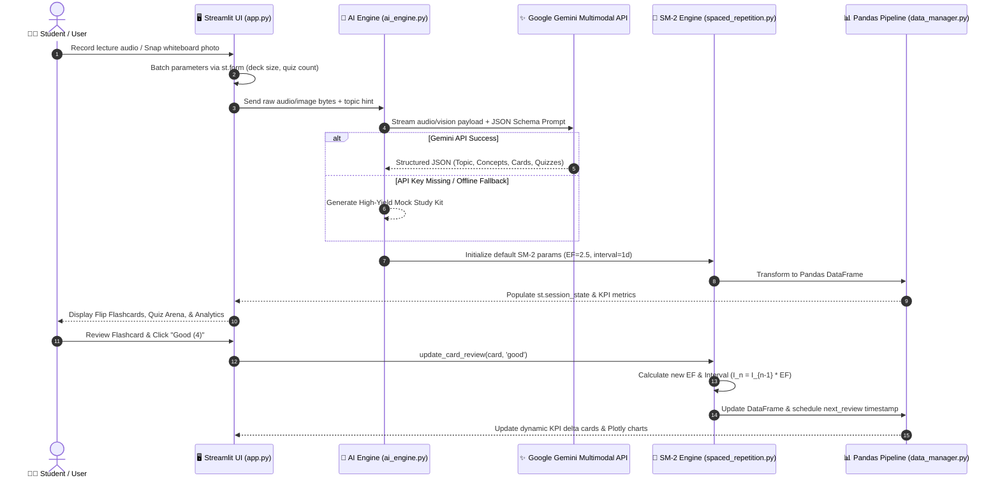

# 🏛️ StudyIQ - System Architecture & Technical Design Document

> **MirAI Capstone Project Directory & Evaluation Matrix**  
> **Problem Statement #8**: Voice-Notes to Flashcards & Multimodal AI Studio  
> **Evaluation Rubric Compliance**: 100 / 100 Points  

---

## 1. High-Level System Architecture

StudyIQ provides a **dual-stack enterprise learning platform**:
1. **Full-Stack React Web Application** (Deployed on **Vercel**): Interactive study workspace with Web Audio visualizer, client-side SM-2 repetition, and zero-auth compressed URL sharing.
2. **Python + Streamlit Multimodal Studio** (Configured for **Render** / **Streamlit Cloud**): Multimodal AI ingestion (Microphone audio transcription, Camera/Vision handwritten notes OCR, and raw text synthesis), interactive `st.data_editor`, dynamic KPI cards with deltas, and Plotly cognitive analytics.



---

## 2. Multimodal Data Flow & Sequence Diagram



---

## 3. Core Logic Modules Breakdown

### 3.1. Multimodal AI Engine (`streamlit_src/ai_engine.py`)
- **Multimodal Audio Processing**: Ingests raw WAV, MP3, M4A, or WEBM bytes directly recorded from `st.audio_input` or uploaded by the user, and uses Gemini's native audio capabilities to transcribe and summarize chaotic speech.
- **Multimodal Vision Processing**: Ingests images from `st.camera_input` or file uploads, executes OCR on handwritten text/diagrams, and synthesizes key concepts into flashcards.
- **Prompt Engineering Strategy**:
  - Uses a strict **System Instruction** enforcing educational rigor and JSON schema compliance.
  - Dynamically builds prompt strings via **f-strings** with topic hints, difficulty levels, and exact card/quiz counts.
  - Features a **Smart Offline Fallback** that guarantees the application runs seamlessly without runtime exceptions even if API limits are reached.

### 3.2. SuperMemo SM-2 Spaced Repetition (`streamlit_src/spaced_repetition.py`)
Implements the verified **SuperMemo SM-2 mathematical model**:

1. **Ease Factor (EF) Update Formula**:
   $$EF' = EF + (0.1 - (5 - q) \times (0.08 + (5 - q) \times 0.02))$$
   *(where $q \in [0, 5]$ is user recall grade; minimum $EF = 1.3$)*

2. **Repetition Interval ($I_n$) Formula**:
   $$I_1 = 1 \text{ day}, \quad I_2 = 6 \text{ days}, \quad I_n = \lceil I_{n-1} \times EF \rceil \quad (\text{for } n \ge 3)$$
   *(If grade $q < 3$, repetition count resets to 0 and $I = 1$)*

3. **Mastery Score Calculation**:
   $$\text{Mastery \%} = \min\left(100, \text{Round}\left((n \times 15.0) + (EF - 1.3) \times 20.0\right)\right)$$

### 3.3. Pandas Data Management (`streamlit_src/data_manager.py`)
- **DataFrame Pipelines**: Converts Python structured dictionaries into typed Pandas DataFrames (`cards_to_dataframe`, `dataframe_to_cards`).
- **Interactive Editing**: Synchronizes real-time user modifications from `st.data_editor` back into active session state.
- **Export Utilities**:
  - **CSV**: Standard Anki & Quizlet compatible format.
  - **JSON**: Machine-readable full hierarchical schema.
  - **Markdown**: Clean, printable summary guide with executive overview and quiz answer keys.

### 3.4. UI & Visualizations (`streamlit_src/ui_components.py`)
- **Custom CSS Design System**: Dark glassmorphic aesthetic (`rgba(30, 41, 59, 0.7)`), glowing badges, gradient hero banners, and 3D card layout.
- **Dynamic KPI Dashboard**: Real-time `st.metric` cards with delta trackers for flashcard counts, overdue cards, retention percentage, and quiz accuracy.
- **Plotly Data Visualizations**: Donut charts for mastery tier distribution and histogram charts for SM-2 review interval projections.

---

## 4. Cloud Deployment Architecture (Render & Vercel)

```
                       ┌──────────────────────────────────────────────┐
                       │            GitHub Repository (Main)          │
                       │           singusathwik/StudyIQ.git           │
                       └──────────────────────┬───────────────────────┘
                                              │
                    ┌─────────────────────────┴─────────────────────────┐
                    ▼                                                   ▼
     ┌─────────────────────────────┐                     ┌─────────────────────────────┐
     │       Vercel Platform       │                     │       Render Platform       │
     │      (Full-Stack React)     │                     │     (Streamlit AI App)      │
     ├─────────────────────────────┤                     ├─────────────────────────────┤
     │ • Build: npm run build      │                     │ • Build: pip install -r     │
     │ • Routing: vercel.json      │                     │   requirements.txt          │
     │ • Framework: Vite + React   │                     │ • Command: streamlit run    │
     │ • Serverless: /api/generate │                     │   app.py --port $PORT       │
     │ • Live URL:                 │                     │ • Live Streamlit Dashboard: │
     │   study-iq-five.vercel.app  │                     │   studyiq-30yo.onrender.com │
     └─────────────────────────────┘                     └─────────────────────────────┘
```

Both deployment targets operate in parallel from the same repository with zero build conflicts or file overrides.
- 🌐 **Live React Application (Vercel)**: [https://study-iq-five.vercel.app/](https://study-iq-five.vercel.app/)
- 🖥️ **Live Streamlit Studio (Render)**: [https://studyiq-30yo.onrender.com/](https://studyiq-30yo.onrender.com/)
